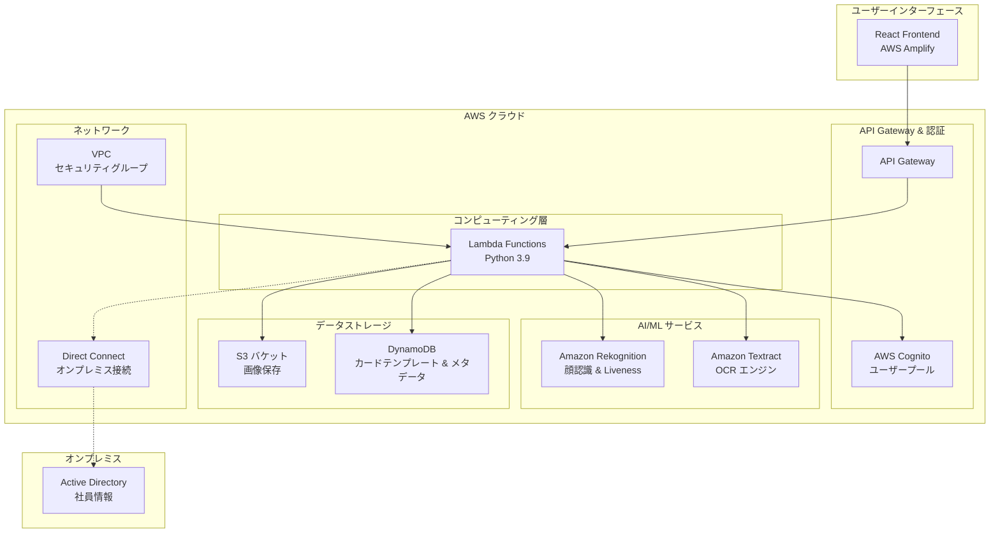
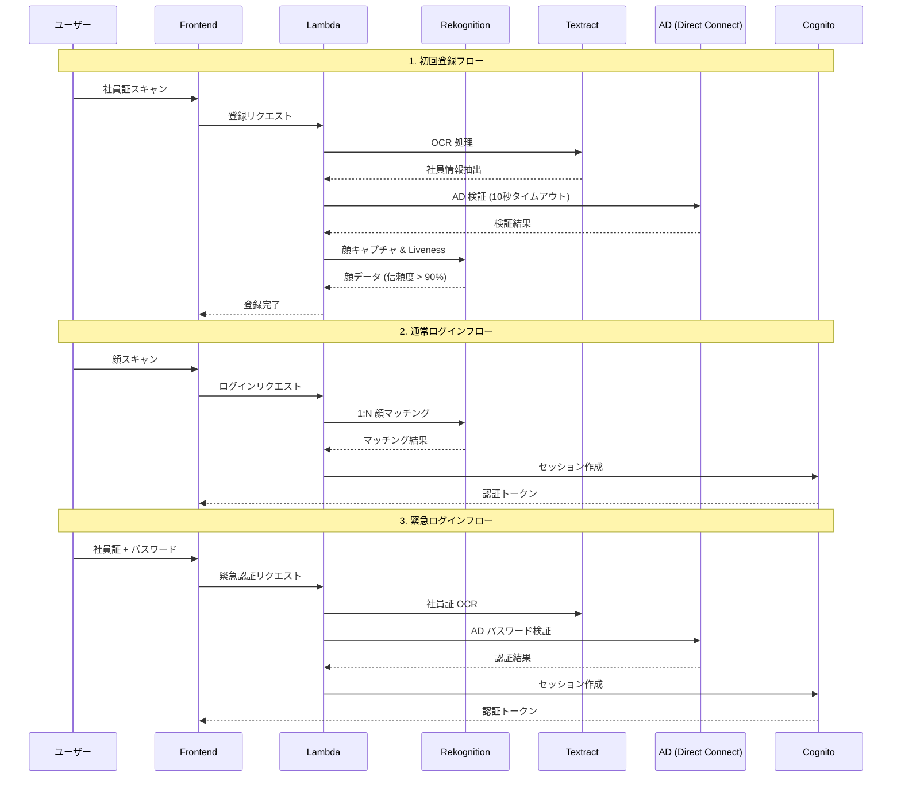

# 設計ドキュメント

## 概要

Face-Auth IdP システムは、AWS クラウドインフラストラクチャを基盤としたエンタープライズグレードの社員認証システムです。このシステムは、社員証ベースの信頼チェーンと Amazon Rekognition を活用した 1:N 顔認識によるパスワードレス認証を提供します。システムは3つの主要な認証フローをサポートします：初回登録/再登録、通常の顔ログイン、および緊急認証です。

コア設計原則:
- **セキュリティ優先**: AWS Direct Connect を通じたオンプレミス AD 接続と厳格なタイムアウト制限
- **拡張性**: DynamoDB ベースのカードテンプレート管理により多様な社員証形式をサポート
- **コスト効率**: S3 Lifecycle ポリシーによる自動データ管理
- **ユーザーエクスペリエンス**: 明確なエラーメッセージングと直感的な React ベース UI

## アーキテクチャ

### 全体システムアーキテクチャ



### 認証フローアーキテクチャ



## コンポーネントとインターフェース

### 1. フロントエンドコンポーネント (React + AWS Amplify)

#### AuthenticationComponent
```typescript
interface AuthenticationProps {
  mode: 'LOGIN' | 'ENROLL' | 'ID_SCAN' | 'EMERGENCY';
  onSuccess: (token: string) => void;
  onError: (error: AuthError) => void;
}

interface AuthError {
  code: string;
  message: string;
  systemReason?: string;
}
```

**主要機能:**
- FaceLivenessDetector 統合
- リアルタイムキャプチャフィードバック
- 複数認証モードサポート
- エラーメッセージのローカライゼーション

#### CameraController
```typescript
interface CameraConfig {
  resolution: { width: number; height: number };
  facingMode: 'user' | 'environment';
  constraints: MediaStreamConstraints;
}
```

### 2. API Gateway と Lambda 関数

#### 主要エンドポイント
```python
# API エンドポイント構造
POST /auth/enroll          # 初回登録
POST /auth/login           # 顔ログイン
POST /auth/emergency       # 緊急認証
POST /auth/re-enroll       # 再登録
GET  /auth/status          # 認証ステータス確認
```

#### Lambda 関数構造
```python
class AuthHandler:
    def __init__(self):
        self.rekognition = boto3.client('rekognition')
        self.textract = boto3.client('textract')
        self.s3 = boto3.client('s3')
        self.dynamodb = boto3.resource('dynamodb')
        self.timeout = 15  # 全体 Lambda タイムアウト
        
    def handle_enrollment(self, event, context):
        # 1. 社員証 OCR 処理
        # 2. AD 検証 (10秒タイムアウト)
        # 3. 顔キャプチャおよび Liveness 検証
        # 4. サムネイル生成および S3 保存
        pass
        
    def handle_face_login(self, event, context):
        # 1. 顔 Liveness 検証
        # 2. 1:N 顔マッチング
        # 3. Cognito セッション作成
        pass
        
    def handle_emergency_auth(self, event, context):
        # 1. 社員証 OCR
        # 2. AD パスワード検証
        # 3. Cognito セッション作成
        pass
```

### 3. Amazon Rekognition 統合

#### 顔認識サービス
```python
class FaceRecognitionService:
    def __init__(self):
        self.collection_id = "face-auth-employees"
        self.confidence_threshold = 90.0
        
    def detect_liveness(self, image_bytes: bytes) -> LivenessResult:
        """Liveness 検出 (信頼度 > 90% 要求)"""
        response = self.rekognition.detect_faces(
            Image={'Bytes': image_bytes},
            Attributes=['ALL']
        )
        return self._process_liveness_result(response)
        
    def search_faces(self, image_bytes: bytes) -> List[FaceMatch]:
        """1:N 顔検索"""
        response = self.rekognition.search_faces_by_image(
            CollectionId=self.collection_id,
            Image={'Bytes': image_bytes},
            FaceMatchThreshold=self.confidence_threshold
        )
        return response['FaceMatches']
        
    def index_face(self, image_bytes: bytes, employee_id: str) -> str:
        """顔登録"""
        response = self.rekognition.index_faces(
            CollectionId=self.collection_id,
            Image={'Bytes': image_bytes},
            ExternalImageId=employee_id
        )
        return response['FaceRecords'][0]['Face']['FaceId']
```

### 4. Amazon Textract OCR エンジン

#### OCR 処理サービス
```python
class OCRService:
    def __init__(self):
        self.textract = boto3.client('textract')
        
    def extract_id_card_info(self, image_bytes: bytes, template: CardTemplate) -> EmployeeInfo:
        """カードテンプレートベースの情報抽出"""
        # Textract Queries 動的構成
        queries = self._build_queries_from_template(template)
        
        response = self.textract.analyze_document(
            Document={'Bytes': image_bytes},
            FeatureTypes=['QUERIES'],
            QueriesConfig={'Queries': queries}
        )
        
        return self._parse_textract_response(response, template)
        
    def _build_queries_from_template(self, template: CardTemplate) -> List[Dict]:
        """テンプレートベースのクエリ構成"""
        queries = []
        for field in template.fields:
            queries.append({
                'Text': field.query_phrase,
                'Alias': field.field_name
            })
        return queries
```

### 5. データストレージ層

#### S3 バケット構造
```
face-auth-bucket/
├── enroll/                    # 登録サムネイル (永久保管)
│   ├── {employee_id}/
│   │   └── face_thumbnail.jpg (200x200)
├── logins/                    # ログイン試行画像 (30日保管)
│   ├── {date}/
│   │   └── {timestamp}_{employee_id}.jpg
└── temp/                      # 一時処理ファイル
    └── {session_id}/
```

#### DynamoDB テーブル設計

**CardTemplates テーブル**
```python
{
    "pattern_id": "company_card_v1",
    "card_type": "standard_employee",
    "logo_position": {"x": 50, "y": 30, "width": 100, "height": 50},
    "fields": [
        {
            "field_name": "employee_id",
            "query_phrase": "社員番号は何ですか？",
            "expected_format": "\\d{6}"
        },
        {
            "field_name": "employee_name", 
            "query_phrase": "氏名は何ですか？",
            "expected_format": "[ぁ-んァ-ヶ一-龠々]{2,4}"
        }
    ],
    "created_at": "2024-01-01T00:00:00Z",
    "is_active": true
}
```

**EmployeeFaces テーブル**
```python
{
    "employee_id": "123456",
    "face_id": "rekognition-face-id",
    "enrollment_date": "2024-01-01T00:00:00Z",
    "last_login": "2024-01-15T09:30:00Z",
    "thumbnail_s3_key": "enroll/123456/face_thumbnail.jpg",
    "is_active": true,
    "re_enrollment_count": 0
}
```

### 6. Active Directory 接続

#### AD コネクターサービス
```python
class ADConnector:
    def __init__(self):
        self.server_url = "ldaps://ad.company.com"
        self.timeout = 10  # AD 接続タイムアウト
        self.base_dn = "ou=employees,dc=company,dc=com"
        
    def verify_employee(self, employee_id: str, extracted_info: Dict) -> ADVerificationResult:
        """社員情報 AD 検証"""
        try:
            server = Server(self.server_url, get_info=ALL, connect_timeout=self.timeout)
            with Connection(server, auto_bind=True) as conn:
                search_filter = f"(employeeID={employee_id})"
                conn.search(self.base_dn, search_filter, attributes=['cn', 'employeeID', 'userAccountControl'])
                
                if not conn.entries:
                    return ADVerificationResult(success=False, reason="employee_not_found")
                    
                entry = conn.entries[0]
                if self._is_account_disabled(entry.userAccountControl.value):
                    return ADVerificationResult(success=False, reason="account_disabled")
                    
                return ADVerificationResult(success=True, employee_data=entry)
                
        except Exception as e:
            return ADVerificationResult(success=False, reason="ad_connection_error", error=str(e))
            
    def authenticate_password(self, employee_id: str, password: str) -> bool:
        """AD パスワード認証"""
        try:
            user_dn = f"cn={employee_id},{self.base_dn}"
            server = Server(self.server_url, connect_timeout=self.timeout)
            conn = Connection(server, user=user_dn, password=password)
            return conn.bind()
        except:
            return False
```

## データモデル

### 1. コアデータ構造

#### EmployeeInfo
```python
@dataclass
class EmployeeInfo:
    employee_id: str
    name: str
    department: str
    card_type: str
    extracted_confidence: float
    
    def validate(self) -> bool:
        """抽出された情報の妥当性検証"""
        return (
            len(self.employee_id) == 6 and
            self.employee_id.isdigit() and
            len(self.name) >= 2 and
            self.extracted_confidence > 0.8
        )
```

#### FaceData
```python
@dataclass
class FaceData:
    face_id: str
    employee_id: str
    bounding_box: Dict[str, float]
    confidence: float
    landmarks: List[Dict]
    thumbnail_s3_key: str
    
    def to_rekognition_format(self) -> Dict:
        """Rekognition API 形式に変換"""
        return {
            'FaceId': self.face_id,
            'BoundingBox': self.bounding_box,
            'Confidence': self.confidence
        }
```

#### AuthenticationSession
```python
@dataclass
class AuthenticationSession:
    session_id: str
    employee_id: str
    auth_method: str  # 'face', 'emergency'
    created_at: datetime
    expires_at: datetime
    cognito_token: str
    
    def is_valid(self) -> bool:
        """セッション有効性確認"""
        return datetime.now() < self.expires_at
```

### 2. 画像処理モデル

#### ThumbnailProcessor
```python
class ThumbnailProcessor:
    TARGET_SIZE = (200, 200)
    QUALITY = 85
    
    def create_thumbnail(self, image_bytes: bytes) -> bytes:
        """200x200 サムネイル生成"""
        with Image.open(BytesIO(image_bytes)) as img:
            # 比率を維持してリサイズ
            img.thumbnail(self.TARGET_SIZE, Image.Resampling.LANCZOS)
            
            # 正方形にパディング
            padded_img = Image.new('RGB', self.TARGET_SIZE, (255, 255, 255))
            offset = ((self.TARGET_SIZE[0] - img.size[0]) // 2,
                     (self.TARGET_SIZE[1] - img.size[1]) // 2)
            padded_img.paste(img, offset)
            
            # JPEG で圧縮
            output = BytesIO()
            padded_img.save(output, format='JPEG', quality=self.QUALITY)
            return output.getvalue()
```

### 3. エラー処理モデル

#### ErrorResponse
```python
@dataclass
class ErrorResponse:
    error_code: str
    user_message: str
    system_reason: str
    timestamp: datetime
    request_id: str
    
    def to_dict(self) -> Dict:
        return {
            'error': self.error_code,
            'message': self.user_message,
            'timestamp': self.timestamp.isoformat(),
            'request_id': self.request_id
        }

# エラーコード定義
class ErrorCodes:
    ID_CARD_FORMAT_MISMATCH = "ID_CARD_FORMAT_MISMATCH"
    REGISTRATION_INFO_MISMATCH = "REGISTRATION_INFO_MISMATCH" 
    ACCOUNT_DISABLED = "ACCOUNT_DISABLED"
    LIVENESS_FAILED = "LIVENESS_FAILED"
    FACE_NOT_FOUND = "FACE_NOT_FOUND"
    AD_CONNECTION_ERROR = "AD_CONNECTION_ERROR"
    GENERIC_ERROR = "GENERIC_ERROR"
```

## 正確性プロパティ (Correctness Properties)

*プロパティ(Property)は、システムのすべての有効な実行において真でなければならない特性または動作です。本質的に、システムが実行すべき作業に対する形式的な仕様です。プロパティは、人間が読める仕様と機械が検証できる正確性保証の橋渡しの役割を果たします。*

### プロパティ 1: OCR エンジン使用の一貫性
*すべての* 身分証処理リクエスト(登録、再登録、緊急認証)に対して、システムは Amazon Textract OCR エンジンを使用しなければならない
**検証対象: 要件 1.1, 3.2, 7.1, 9.1**

### プロパティ 2: カードテンプレートベース処理
*すべての* OCR 処理に対して、システムは DynamoDB から Card_Template パターンを取得し、これを使用して Textract Query を構成しなければならない
**検証対象: 要件 1.2, 7.2**

### プロパティ 3: AD 接続タイムアウト遵守
*すべての* Active Directory 接続および認証リクエストに対して、AD_Connector は 10秒以内に完了しなければならない
**検証対象: 要件 1.3, 3.4, 4.2**

### プロパティ 4: Liveness Detection 必須使用
*すべての* 顔キャプチャ作業に対して、システムは Amazon Rekognition Liveness Detection を使用し、90%より大きい信頼度を要求しなければならない
**検証対象: 要件 2.1, 6.1, 6.2**

### プロパティ 5: 1:N 顔マッチング実行
*すべての* 成功した顔キャプチャ(信頼度 > 90%)に対して、Face_Matcher は登録されたすべての Face_Data に対して Amazon Rekognition を使用した 1:N マッチングを実行しなければならない
**検証対象: 要件 2.2, 6.4**

### プロパティ 6: 認証セッション作成
*すべての* 成功した認証(顔マッチングまたは AD 認証)に対して、システムは AWS Cognito を通じて Authentication_Session を作成しなければならない
**検証対象: 要件 2.3, 3.5**

### プロパティ 7: 失敗したログイン試行の保存
*すべての* 失敗した顔マッチングに対して、システムは Login_Attempt_Image をサムネイルに変換して S3 logins/ フォルダに保存しなければならない
**検証対象: 要件 2.4, 5.3**

### プロパティ 8: 緊急ログインオプション提供
*すべての* 顔認識失敗に対して、システムはユーザーに緊急認証オプションを提供しなければならない
**検証対象: 要件 2.6, 3.1**

### プロパティ 9: サムネイル処理の一貫性
*すべての* 登録およびログイン画像に対して、Thumbnail_Processor は 200x200 ピクセルのサムネイルを生成し、元の画像を削除しなければならない
**検証対象: 要件 1.5, 5.1**

### プロパティ 10: 具体的エラーメッセージ返却
*すべての* システム判断エラー(カード形式不一致、登録情報不一致、アカウント無効化)に対して、システムは対応する具体的なエラーメッセージを返却しなければならない
**検証対象: 要件 1.6, 1.7, 1.8, 8.2, 8.3, 8.4**

### プロパティ 11: 一般的エラーメッセージ表示
*すべての* 技術的問題(Liveness 失敗、照明、カメラ、ネットワーク問題)に対して、システムは「明るい場所で再度お試しください」メッセージを表示しなければならない
**検証対象: 要件 2.7, 3.7, 8.5**

### プロパティ 12: Lambda タイムアウト遵守
*すべての* Lambda 関数実行に対して、システムは 15秒の総タイムアウト内にすべての作業を完了しなければならない
**検証対象: 要件 4.3**

### プロパティ 13: データ暗号化適用
*すべての* Face_Data 保存および転送に対して、システムは AWS 暗号化標準を使用しなければならない
**検証対象: 要件 4.6, 5.6**

### プロパティ 14: アクセス制御および監査ログ
*すべての* Face_Data アクセスに対して、システムは適切なアクセス制御を適用し、タイムスタンプとともに監査ログを記録しなければならない
**検証対象: 要件 5.7, 6.7**

### プロパティ 15: カードテンプレートデータ構造
*すべての* Card_Template レコードに対して、システムはロゴ位置と Textract Query フレーズを含む完全なデータ構造を保存しなければならない
**検証対象: 要件 7.4**

### プロパティ 16: 動的クエリ構成
*すべての* Textract 処理に対して、システムはカードパターンを基に動的に Query を構成しなければならない
**検証対象: 要件 7.6**

### プロパティ 17: ランタイムテンプレート更新
*すべての* カードテンプレート更新に対して、システムは再起動なしに変更を適用しなければならない
**検証対象: 要件 7.7**

### プロパティ 18: エラーレスポンス構造分離
*すべての* エラーレスポンスに対して、システムは system_reason(ログ用)と user_message(表示用)を分離しなければならない
**検証対象: 要件 8.6**

### プロパティ 19: 詳細エラーログ
*すべての* エラー記録に対して、システムは問題解決のための詳細な技術情報を含めなければならない
**検証対象: 要件 8.7**

### プロパティ 20: 再登録データ置換
*すべての* 成功した再登録に対して、システムは既存の Face_Data を新しいサムネイルで置換し、監査追跡を記録しなければならない
**検証対象: 要件 9.3, 9.5**

### プロパティ 21: 再登録失敗時のデータ保存
*すべての* 失敗した再登録に対して、システムは既存の Face_Data を変更せずに保存しなければならない
**検証対象: 要件 9.6**

### プロパティ 22: UI モードサポート
*すべての* 認証モード選択に対して、システムは LOGIN, ENROLL, ID_SCAN モードをサポートしなければならない
**検証対象: 要件 10.3**

### プロパティ 23: 成功した認証後のリダイレクト
*すべての* 成功した認証に対して、システムは適切な保護されたリソースにリダイレクトしなければならない
**検証対象: 要件 10.7**

### プロパティ 24: レート制限実装
*すべての* 繰り返し認証失敗に対して、システムはセキュリティのための段階的レート制限を実装しなければならない
**検証対象: 要件 3.6, 6.6**

## エラー処理

### エラー分類体系

#### 1. システム判断エラー (具体的メッセージ)
- **ID_CARD_FORMAT_MISMATCH**: "社員証規格不一致"
- **REGISTRATION_INFO_MISMATCH**: "登録情報不一致"  
- **ACCOUNT_DISABLED**: "アカウント無効化"

#### 2. 技術的問題 (一般的メッセージ)
- **LIVENESS_FAILED**: "明るい場所で再度お試しください"
- **CAMERA_ERROR**: "明るい場所で再度お試しください"
- **NETWORK_ERROR**: "明るい場所で再度お試しください"

#### 3. システムエラー (内部処理)
- **AD_CONNECTION_TIMEOUT**: AD 接続 10秒超過
- **LAMBDA_TIMEOUT**: Lambda 15秒超過
- **REKOGNITION_ERROR**: Amazon Rekognition サービスエラー
- **TEXTRACT_ERROR**: Amazon Textract サービスエラー

### エラー処理戦略

```python
class ErrorHandler:
    def __init__(self):
        self.error_mappings = {
            # システム判断エラー
            "ID_CARD_FORMAT_MISMATCH": {
                "user_message": "社員証規格不一致",
                "system_reason": "No matching card template found",
                "retry_allowed": True
            },
            "REGISTRATION_INFO_MISMATCH": {
                "user_message": "登録情報不一致", 
                "system_reason": "Employee data mismatch with AD records",
                "retry_allowed": True
            },
            "ACCOUNT_DISABLED": {
                "user_message": "アカウント無効化",
                "system_reason": "AD account is disabled",
                "retry_allowed": False
            },
            # 技術的問題
            "LIVENESS_FAILED": {
                "user_message": "明るい場所で再度お試しください",
                "system_reason": "Liveness detection confidence < 90%",
                "retry_allowed": True
            }
        }
        
    def handle_error(self, error_code: str, context: Dict) -> ErrorResponse:
        """統合エラー処理"""
        mapping = self.error_mappings.get(error_code, self._get_default_error())
        
        return ErrorResponse(
            error_code=error_code,
            user_message=mapping["user_message"],
            system_reason=f"{mapping['system_reason']} | Context: {context}",
            timestamp=datetime.now(),
            request_id=context.get("request_id"),
            retry_allowed=mapping["retry_allowed"]
        )
```

### タイムアウト管理

```python
class TimeoutManager:
    AD_TIMEOUT = 10  # seconds
    LAMBDA_TIMEOUT = 15  # seconds
    
    def __init__(self):
        self.start_time = time.time()
        
    def check_ad_timeout(self) -> bool:
        """AD 接続タイムアウト確認"""
        elapsed = time.time() - self.start_time
        return elapsed < self.AD_TIMEOUT
        
    def check_lambda_timeout(self) -> bool:
        """Lambda 全体タイムアウト確認"""
        elapsed = time.time() - self.start_time
        return elapsed < self.LAMBDA_TIMEOUT
        
    def get_remaining_time(self) -> float:
        """残り時間を返却"""
        elapsed = time.time() - self.start_time
        return max(0, self.LAMBDA_TIMEOUT - elapsed)
```

## テスト戦略

### 二重テストアプローチ

システムの包括的な検証のため、ユニットテストとプロパティベーステストの両方を使用します:

- **ユニットテスト**: 具体的な例、エッジケース、エラー条件の検証
- **プロパティテスト**: すべての入力に対する汎用プロパティの検証
- 両アプローチは相互補完的です (ユニットテストは具体的なバグを捕捉し、プロパティテストは一般的な正確性を検証)

### プロパティベーステスト構成

**テストライブラリ**: Python の `hypothesis` ライブラリを使用
**テスト反復回数**: プロパティあたり最低 100回反復 (ランダム化による)
**タグ形式**: **Feature: face-auth, Property {番号}: {プロパティテキスト}**

#### プロパティテスト例

```python
from hypothesis import given, strategies as st
import pytest

class TestFaceAuthProperties:
    
    @given(st.binary(min_size=1000, max_size=10000))
    def test_property_1_ocr_engine_consistency(self, id_card_image):
        """
        Feature: face-auth, Property 1: OCR エンジン使用の一貫性
        すべての身分証処理リクエストに対して Amazon Textract OCR エンジン使用
        """
        # Given: 任意の身分証画像
        request = EnrollmentRequest(id_card_image=id_card_image)
        
        # When: 登録処理
        with patch('boto3.client') as mock_boto:
            mock_textract = mock_boto.return_value
            handler = AuthHandler()
            handler.process_id_card(request)
            
        # Then: Textract が呼び出されるべき
        mock_textract.analyze_document.assert_called_once()
        
    @given(st.binary(min_size=1000, max_size=10000))
    def test_property_4_liveness_detection_required(self, face_image):
        """
        Feature: face-auth, Property 4: Liveness Detection 必須使用
        すべての顔キャプチャに対して Liveness Detection 使用および 90% 信頼度要求
        """
        # Given: 任意の顔画像
        request = FaceLoginRequest(face_image=face_image)
        
        # When: 顔ログイン処理
        with patch('boto3.client') as mock_boto:
            mock_rekognition = mock_boto.return_value
            mock_rekognition.detect_faces.return_value = {
                'FaceDetails': [{'Confidence': 95.0}]
            }
            
            handler = AuthHandler()
            result = handler.process_face_login(request)
            
        # Then: Rekognition detect_faces が呼び出されるべき
        mock_rekognition.detect_faces.assert_called_once()
        call_args = mock_rekognition.detect_faces.call_args
        assert 'Attributes' in call_args[1]
        
    @given(st.integers(min_value=1, max_value=1000))
    def test_property_12_lambda_timeout_compliance(self, processing_time):
        """
        Feature: face-auth, Property 12: Lambda タイムアウト遵守
        すべての Lambda 実行が 15秒以内に完了
        """
        # Given: 任意の処理時間を持つリクエスト
        request = AuthRequest()
        
        # When: タイムアウトマネージャーで処理
        timeout_manager = TimeoutManager()
        start_time = time.time()
        
        # 処理をシミュレート
        time.sleep(min(processing_time / 1000, 0.1))  # 最大 0.1秒に制限
        
        # Then: 15秒制限内にあるべき
        elapsed = time.time() - start_time
        assert timeout_manager.check_lambda_timeout()
        assert elapsed < TimeoutManager.LAMBDA_TIMEOUT
```

### ユニットテスト戦略

**具体的な例のテスト**:
- 既知の社員証形式での登録テスト
- 特定のエラー条件 (無効アカウント、形式不一致) テスト
- 境界値テスト (正確に 90% 信頼度、10秒タイムアウト)

**統合テスト**:
- AWS サービス間連携テスト
- 完全な認証フローテスト
- エラー回復シナリオテスト

**パフォーマンステスト**:
- 同時ユーザー負荷テスト
- メモリ使用量モニタリング
- AWS サービス制限テスト

### テストデータ管理

```python
class TestDataGenerator:
    """テスト用データ生成器"""
    
    def generate_employee_id_card(self, card_type: str = "standard") -> bytes:
        """テスト用社員証画像生成"""
        # PIL を使用してテスト用社員証画像を生成
        pass
        
    def generate_face_image(self, confidence_level: float = 95.0) -> bytes:
        """テスト用顔画像生成"""
        # 指定された信頼度レベルのテスト用顔画像を生成
        pass
        
    def generate_card_template(self) -> CardTemplate:
        """テスト用カードテンプレート生成"""
        return CardTemplate(
            pattern_id="test_card_v1",
            card_type="test_employee",
            logo_position={"x": 50, "y": 30, "width": 100, "height": 50},
            fields=[
                {
                    "field_name": "employee_id",
                    "query_phrase": "社員番号は何ですか？",
                    "expected_format": "\\d{6}"
                }
            ]
        )
```

このテスト戦略は、システムのすべてのコア機能とプロパティを検証し、AWS ベースの Face-Auth IdP システムの信頼性と正確性を保証します。