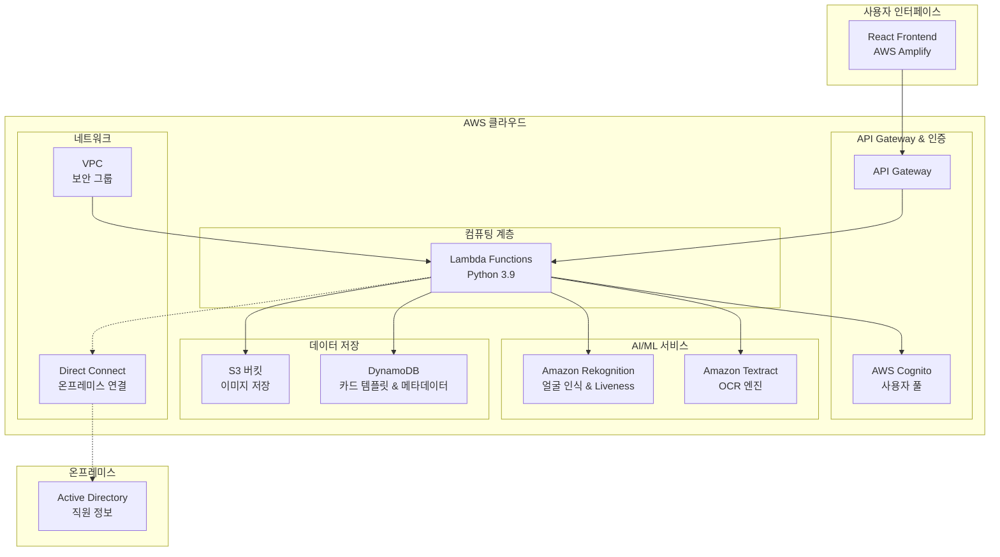
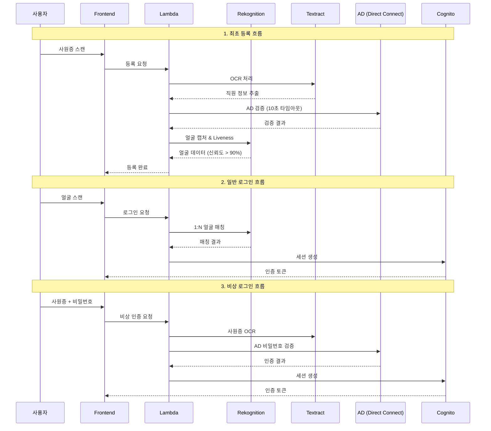

# 설계 문서

## 개요

Face-Auth IdP 시스템은 AWS 클라우드 인프라를 기반으로 한 엔터프라이즈급 직원 인증 시스템입니다. 이 시스템은 사원증 기반 신뢰 체인과 Amazon Rekognition을 활용한 1:N 얼굴 인식을 통해 무패스워드 인증을 제공합니다. 시스템은 세 가지 주요 인증 흐름을 지원합니다: 최초 등록/재등록, 일반 얼굴 로그인, 그리고 비상 인증입니다.

핵심 설계 원칙:
- **보안 우선**: AWS Direct Connect를 통한 온프레미스 AD 연결과 엄격한 타임아웃 제한
- **확장성**: DynamoDB 기반 카드 템플릿 관리로 다양한 사원증 형식 지원
- **비용 효율성**: S3 Lifecycle 정책을 통한 자동 데이터 관리
- **사용자 경험**: 명확한 오류 메시징과 직관적인 React 기반 UI

## 아키텍처

### 전체 시스템 아키텍처



### 인증 흐름 아키텍처



## 구성 요소 및 인터페이스

### 1. 프론트엔드 구성 요소 (React + AWS Amplify)

#### AuthenticationComponent
```typescript
interface AuthenticationProps {
  mode: 'LOGIN' | 'ENROLL' | 'ID_SCAN' | 'EMERGENCY';
  onSuccess: (token: string) => void;
  onError: (error: AuthError) => void;
}

interface AuthError {
  code: string;
  message: string;
  systemReason?: string;
}
```

**주요 기능:**
- FaceLivenessDetector 통합
- 실시간 캡처 피드백
- 다중 인증 모드 지원
- 오류 메시지 현지화

#### CameraController
```typescript
interface CameraConfig {
  resolution: { width: number; height: number };
  facingMode: 'user' | 'environment';
  constraints: MediaStreamConstraints;
}
```

### 2. API Gateway 및 Lambda 함수

#### 주요 엔드포인트
```python
# API 엔드포인트 구조
POST /auth/enroll          # 최초 등록
POST /auth/login           # 얼굴 로그인
POST /auth/emergency       # 비상 인증
POST /auth/re-enroll       # 재등록
GET  /auth/status          # 인증 상태 확인
```

#### Lambda 함수 구조
```python
class AuthHandler:
    def __init__(self):
        self.rekognition = boto3.client('rekognition')
        self.textract = boto3.client('textract')
        self.s3 = boto3.client('s3')
        self.dynamodb = boto3.resource('dynamodb')
        self.timeout = 15  # 전체 Lambda 타임아웃
        
    def handle_enrollment(self, event, context):
        # 1. 사원증 OCR 처리
        # 2. AD 검증 (10초 타임아웃)
        # 3. 얼굴 캡처 및 Liveness 검증
        # 4. 썸네일 생성 및 S3 저장
        pass
        
    def handle_face_login(self, event, context):
        # 1. 얼굴 Liveness 검증
        # 2. 1:N 얼굴 매칭
        # 3. Cognito 세션 생성
        pass
        
    def handle_emergency_auth(self, event, context):
        # 1. 사원증 OCR
        # 2. AD 비밀번호 검증
        # 3. Cognito 세션 생성
        pass
```

### 3. Amazon Rekognition 통합

#### 얼굴 인식 서비스
```python
class FaceRecognitionService:
    def __init__(self):
        self.collection_id = "face-auth-employees"
        self.confidence_threshold = 90.0
        
    def detect_liveness(self, image_bytes: bytes) -> LivenessResult:
        """Liveness 감지 (신뢰도 > 90% 요구)"""
        response = self.rekognition.detect_faces(
            Image={'Bytes': image_bytes},
            Attributes=['ALL']
        )
        return self._process_liveness_result(response)
        
    def search_faces(self, image_bytes: bytes) -> List[FaceMatch]:
        """1:N 얼굴 검색"""
        response = self.rekognition.search_faces_by_image(
            CollectionId=self.collection_id,
            Image={'Bytes': image_bytes},
            FaceMatchThreshold=self.confidence_threshold
        )
        return response['FaceMatches']
        
    def index_face(self, image_bytes: bytes, employee_id: str) -> str:
        """얼굴 등록"""
        response = self.rekognition.index_faces(
            CollectionId=self.collection_id,
            Image={'Bytes': image_bytes},
            ExternalImageId=employee_id
        )
        return response['FaceRecords'][0]['Face']['FaceId']
```

### 4. Amazon Textract OCR 엔진

#### OCR 처리 서비스
```python
class OCRService:
    def __init__(self):
        self.textract = boto3.client('textract')
        
    def extract_id_card_info(self, image_bytes: bytes, template: CardTemplate) -> EmployeeInfo:
        """카드 템플릿 기반 정보 추출"""
        # Textract Queries 동적 구성
        queries = self._build_queries_from_template(template)
        
        response = self.textract.analyze_document(
            Document={'Bytes': image_bytes},
            FeatureTypes=['QUERIES'],
            QueriesConfig={'Queries': queries}
        )
        
        return self._parse_textract_response(response, template)
        
    def _build_queries_from_template(self, template: CardTemplate) -> List[Dict]:
        """템플릿 기반 쿼리 구성"""
        queries = []
        for field in template.fields:
            queries.append({
                'Text': field.query_phrase,
                'Alias': field.field_name
            })
        return queries
```

### 5. 데이터 저장 계층

#### S3 버킷 구조
```
face-auth-bucket/
├── enroll/                    # 등록 썸네일 (영구 보관)
│   ├── {employee_id}/
│   │   └── face_thumbnail.jpg (200x200)
├── logins/                    # 로그인 시도 이미지 (30일 보관)
│   ├── {date}/
│   │   └── {timestamp}_{employee_id}.jpg
└── temp/                      # 임시 처리 파일
    └── {session_id}/
```

#### DynamoDB 테이블 설계

**CardTemplates 테이블**
```python
{
    "pattern_id": "company_card_v1",
    "card_type": "standard_employee",
    "logo_position": {"x": 50, "y": 30, "width": 100, "height": 50},
    "fields": [
        {
            "field_name": "employee_id",
            "query_phrase": "사번은 무엇입니까?",
            "expected_format": "\\d{6}"
        },
        {
            "field_name": "employee_name", 
            "query_phrase": "성명은 무엇입니까?",
            "expected_format": "[가-힣]{2,4}"
        }
    ],
    "created_at": "2024-01-01T00:00:00Z",
    "is_active": true
}
```

**EmployeeFaces 테이블**
```python
{
    "employee_id": "123456",
    "face_id": "rekognition-face-id",
    "enrollment_date": "2024-01-01T00:00:00Z",
    "last_login": "2024-01-15T09:30:00Z",
    "thumbnail_s3_key": "enroll/123456/face_thumbnail.jpg",
    "is_active": true,
    "re_enrollment_count": 0
}
```

### 6. Active Directory 연결

#### AD 커넥터 서비스
```python
class ADConnector:
    def __init__(self):
        self.server_url = "ldaps://ad.company.com"
        self.timeout = 10  # AD 연결 타임아웃
        self.base_dn = "ou=employees,dc=company,dc=com"
        
    def verify_employee(self, employee_id: str, extracted_info: Dict) -> ADVerificationResult:
        """직원 정보 AD 검증"""
        try:
            server = Server(self.server_url, get_info=ALL, connect_timeout=self.timeout)
            with Connection(server, auto_bind=True) as conn:
                search_filter = f"(employeeID={employee_id})"
                conn.search(self.base_dn, search_filter, attributes=['cn', 'employeeID', 'userAccountControl'])
                
                if not conn.entries:
                    return ADVerificationResult(success=False, reason="employee_not_found")
                    
                entry = conn.entries[0]
                if self._is_account_disabled(entry.userAccountControl.value):
                    return ADVerificationResult(success=False, reason="account_disabled")
                    
                return ADVerificationResult(success=True, employee_data=entry)
                
        except Exception as e:
            return ADVerificationResult(success=False, reason="ad_connection_error", error=str(e))
            
    def authenticate_password(self, employee_id: str, password: str) -> bool:
        """AD 비밀번호 인증"""
        try:
            user_dn = f"cn={employee_id},{self.base_dn}"
            server = Server(self.server_url, connect_timeout=self.timeout)
            conn = Connection(server, user=user_dn, password=password)
            return conn.bind()
        except:
            return False
```

## 데이터 모델

### 1. 핵심 데이터 구조

#### EmployeeInfo
```python
@dataclass
class EmployeeInfo:
    employee_id: str
    name: str
    department: str
    card_type: str
    extracted_confidence: float
    
    def validate(self) -> bool:
        """추출된 정보 유효성 검증"""
        return (
            len(self.employee_id) == 6 and
            self.employee_id.isdigit() and
            len(self.name) >= 2 and
            self.extracted_confidence > 0.8
        )
```

#### FaceData
```python
@dataclass
class FaceData:
    face_id: str
    employee_id: str
    bounding_box: Dict[str, float]
    confidence: float
    landmarks: List[Dict]
    thumbnail_s3_key: str
    
    def to_rekognition_format(self) -> Dict:
        """Rekognition API 형식으로 변환"""
        return {
            'FaceId': self.face_id,
            'BoundingBox': self.bounding_box,
            'Confidence': self.confidence
        }
```

#### AuthenticationSession
```python
@dataclass
class AuthenticationSession:
    session_id: str
    employee_id: str
    auth_method: str  # 'face', 'emergency'
    created_at: datetime
    expires_at: datetime
    cognito_token: str
    
    def is_valid(self) -> bool:
        """세션 유효성 확인"""
        return datetime.now() < self.expires_at
```

### 2. 이미지 처리 모델

#### ThumbnailProcessor
```python
class ThumbnailProcessor:
    TARGET_SIZE = (200, 200)
    QUALITY = 85
    
    def create_thumbnail(self, image_bytes: bytes) -> bytes:
        """200x200 썸네일 생성"""
        with Image.open(BytesIO(image_bytes)) as img:
            # 비율 유지하며 리사이즈
            img.thumbnail(self.TARGET_SIZE, Image.Resampling.LANCZOS)
            
            # 정사각형으로 패딩
            padded_img = Image.new('RGB', self.TARGET_SIZE, (255, 255, 255))
            offset = ((self.TARGET_SIZE[0] - img.size[0]) // 2,
                     (self.TARGET_SIZE[1] - img.size[1]) // 2)
            padded_img.paste(img, offset)
            
            # JPEG로 압축
            output = BytesIO()
            padded_img.save(output, format='JPEG', quality=self.QUALITY)
            return output.getvalue()
```

### 3. 오류 처리 모델

#### ErrorResponse
```python
@dataclass
class ErrorResponse:
    error_code: str
    user_message: str
    system_reason: str
    timestamp: datetime
    request_id: str
    
    def to_dict(self) -> Dict:
        return {
            'error': self.error_code,
            'message': self.user_message,
            'timestamp': self.timestamp.isoformat(),
            'request_id': self.request_id
        }

# 오류 코드 정의
class ErrorCodes:
    ID_CARD_FORMAT_MISMATCH = "ID_CARD_FORMAT_MISMATCH"
    REGISTRATION_INFO_MISMATCH = "REGISTRATION_INFO_MISMATCH" 
    ACCOUNT_DISABLED = "ACCOUNT_DISABLED"
    LIVENESS_FAILED = "LIVENESS_FAILED"
    FACE_NOT_FOUND = "FACE_NOT_FOUND"
    AD_CONNECTION_ERROR = "AD_CONNECTION_ERROR"
    GENERIC_ERROR = "GENERIC_ERROR"
```

## 정확성 속성 (Correctness Properties)

*속성(Property)은 시스템의 모든 유효한 실행에서 참이어야 하는 특성 또는 동작입니다. 본질적으로 시스템이 수행해야 하는 작업에 대한 공식적인 명세입니다. 속성은 사람이 읽을 수 있는 사양과 기계가 검증할 수 있는 정확성 보장 사이의 다리 역할을 합니다.*

### 속성 1: OCR 엔진 사용 일관성
*모든* 신분증 처리 요청(등록, 재등록, 비상 인증)에 대해, 시스템은 Amazon Textract OCR 엔진을 사용해야 한다
**검증 대상: 요구사항 1.1, 3.2, 7.1, 9.1**

### 속성 2: 카드 템플릿 기반 처리
*모든* OCR 처리에 대해, 시스템은 DynamoDB에서 Card_Template 패턴을 조회하고 이를 사용하여 Textract Query를 구성해야 한다
**검증 대상: 요구사항 1.2, 7.2**

### 속성 3: AD 연결 타임아웃 준수
*모든* Active Directory 연결 및 인증 요청에 대해, AD_Connector는 10초 이내에 완료되어야 한다
**검증 대상: 요구사항 1.3, 3.4, 4.2**

### 속성 4: Liveness Detection 필수 사용
*모든* 얼굴 캡처 작업에 대해, 시스템은 Amazon Rekognition Liveness Detection을 사용하고 90%보다 큰 신뢰도를 요구해야 한다
**검증 대상: 요구사항 2.1, 6.1, 6.2**

### 속성 5: 1:N 얼굴 매칭 수행
*모든* 성공적인 얼굴 캡처(신뢰도 > 90%)에 대해, Face_Matcher는 등록된 모든 Face_Data에 대해 Amazon Rekognition을 사용한 1:N 매칭을 수행해야 한다
**검증 대상: 요구사항 2.2, 6.4**

### 속성 6: 인증 세션 생성
*모든* 성공적인 인증(얼굴 매칭 또는 AD 인증)에 대해, 시스템은 AWS Cognito를 통해 Authentication_Session을 생성해야 한다
**검증 대상: 요구사항 2.3, 3.5**

### 속성 7: 실패한 로그인 시도 저장
*모든* 실패한 얼굴 매칭에 대해, 시스템은 Login_Attempt_Image를 썸네일로 변환하여 S3 logins/ 폴더에 저장해야 한다
**검증 대상: 요구사항 2.4, 5.3**

### 속성 8: 비상 로그인 옵션 제공
*모든* 얼굴 인식 실패에 대해, 시스템은 사용자에게 비상 인증 옵션을 제공해야 한다
**검증 대상: 요구사항 2.6, 3.1**

### 속성 9: 썸네일 처리 일관성
*모든* 등록 및 로그인 이미지에 대해, Thumbnail_Processor는 200x200 픽셀 썸네일을 생성하고 원본 이미지를 삭제해야 한다
**검증 대상: 요구사항 1.5, 5.1**

### 속성 10: 구체적 오류 메시지 반환
*모든* 시스템 판단 오류(카드 형식 불일치, 등록 정보 불일치, 계정 비활성화)에 대해, 시스템은 해당하는 구체적인 오류 메시지를 반환해야 한다
**검증 대상: 요구사항 1.6, 1.7, 1.8, 8.2, 8.3, 8.4**

### 속성 11: 일반적 오류 메시지 표시
*모든* 기술적 문제(Liveness 실패, 조명, 카메라, 네트워크 문제)에 대해, 시스템은 "밝은 곳에서 다시 시도해주세요" 메시지를 표시해야 한다
**검증 대상: 요구사항 2.7, 3.7, 8.5**

### 속성 12: Lambda 타임아웃 준수
*모든* Lambda 함수 실행에 대해, 시스템은 15초 총 타임아웃 내에 모든 작업을 완료해야 한다
**검증 대상: 요구사항 4.3**

### 속성 13: 데이터 암호화 적용
*모든* Face_Data 저장 및 전송에 대해, 시스템은 AWS 암호화 표준을 사용해야 한다
**검증 대상: 요구사항 4.6, 5.6**

### 속성 14: 접근 제어 및 감사 로깅
*모든* Face_Data 접근에 대해, 시스템은 적절한 접근 제어를 적용하고 타임스탬프와 함께 감사 로그를 기록해야 한다
**검증 대상: 요구사항 5.7, 6.7**

### 속성 15: 카드 템플릿 데이터 구조
*모든* Card_Template 레코드에 대해, 시스템은 로고 위치와 Textract Query 문구를 포함한 완전한 데이터 구조를 저장해야 한다
**검증 대상: 요구사항 7.4**

### 속성 16: 동적 쿼리 구성
*모든* Textract 처리에 대해, 시스템은 카드 패턴을 기반으로 동적으로 Query를 구성해야 한다
**검증 대상: 요구사항 7.6**

### 속성 17: 런타임 템플릿 업데이트
*모든* 카드 템플릿 업데이트에 대해, 시스템은 재시작 없이 변경 사항을 적용해야 한다
**검증 대상: 요구사항 7.7**

### 속성 18: 오류 응답 구조 분리
*모든* 오류 응답에 대해, 시스템은 system_reason(로깅용)과 user_message(표시용)를 분리해야 한다
**검증 대상: 요구사항 8.6**

### 속성 19: 상세 오류 로깅
*모든* 오류 기록에 대해, 시스템은 문제 해결을 위한 상세한 기술 정보를 포함해야 한다
**검증 대상: 요구사항 8.7**

### 속성 20: 재등록 데이터 교체
*모든* 성공적인 재등록에 대해, 시스템은 기존 Face_Data를 새로운 썸네일로 교체하고 감사 추적을 기록해야 한다
**검증 대상: 요구사항 9.3, 9.5**

### 속성 21: 재등록 실패 시 데이터 보존
*모든* 실패한 재등록에 대해, 시스템은 기존 Face_Data를 변경하지 않고 보존해야 한다
**검증 대상: 요구사항 9.6**

### 속성 22: UI 모드 지원
*모든* 인증 모드 선택에 대해, 시스템은 LOGIN, ENROLL, ID_SCAN 모드를 지원해야 한다
**검증 대상: 요구사항 10.3**

### 속성 23: 성공적 인증 후 리디렉션
*모든* 성공적인 인증에 대해, 시스템은 적절한 보호된 리소스로 리디렉션해야 한다
**검증 대상: 요구사항 10.7**

### 속성 24: 속도 제한 구현
*모든* 반복적인 인증 실패에 대해, 시스템은 보안을 위한 점진적 속도 제한을 구현해야 한다
**검증 대상: 요구사항 3.6, 6.6**

## 오류 처리

### 오류 분류 체계

#### 1. 시스템 판단 오류 (구체적 메시지)
- **ID_CARD_FORMAT_MISMATCH**: "사원증 규격 불일치"
- **REGISTRATION_INFO_MISMATCH**: "등록 정보 불일치"  
- **ACCOUNT_DISABLED**: "계정 비활성화"

#### 2. 기술적 문제 (일반적 메시지)
- **LIVENESS_FAILED**: "밝은 곳에서 다시 시도해주세요"
- **CAMERA_ERROR**: "밝은 곳에서 다시 시도해주세요"
- **NETWORK_ERROR**: "밝은 곳에서 다시 시도해주세요"

#### 3. 시스템 오류 (내부 처리)
- **AD_CONNECTION_TIMEOUT**: AD 연결 10초 초과
- **LAMBDA_TIMEOUT**: Lambda 15초 초과
- **REKOGNITION_ERROR**: Amazon Rekognition 서비스 오류
- **TEXTRACT_ERROR**: Amazon Textract 서비스 오류

### 오류 처리 전략

```python
class ErrorHandler:
    def __init__(self):
        self.error_mappings = {
            # 시스템 판단 오류
            "ID_CARD_FORMAT_MISMATCH": {
                "user_message": "사원증 규격 불일치",
                "system_reason": "No matching card template found",
                "retry_allowed": True
            },
            "REGISTRATION_INFO_MISMATCH": {
                "user_message": "등록 정보 불일치", 
                "system_reason": "Employee data mismatch with AD records",
                "retry_allowed": True
            },
            "ACCOUNT_DISABLED": {
                "user_message": "계정 비활성화",
                "system_reason": "AD account is disabled",
                "retry_allowed": False
            },
            # 기술적 문제
            "LIVENESS_FAILED": {
                "user_message": "밝은 곳에서 다시 시도해주세요",
                "system_reason": "Liveness detection confidence < 90%",
                "retry_allowed": True
            }
        }
        
    def handle_error(self, error_code: str, context: Dict) -> ErrorResponse:
        """통합 오류 처리"""
        mapping = self.error_mappings.get(error_code, self._get_default_error())
        
        return ErrorResponse(
            error_code=error_code,
            user_message=mapping["user_message"],
            system_reason=f"{mapping['system_reason']} | Context: {context}",
            timestamp=datetime.now(),
            request_id=context.get("request_id"),
            retry_allowed=mapping["retry_allowed"]
        )
```

### 타임아웃 관리

```python
class TimeoutManager:
    AD_TIMEOUT = 10  # seconds
    LAMBDA_TIMEOUT = 15  # seconds
    
    def __init__(self):
        self.start_time = time.time()
        
    def check_ad_timeout(self) -> bool:
        """AD 연결 타임아웃 확인"""
        elapsed = time.time() - self.start_time
        return elapsed < self.AD_TIMEOUT
        
    def check_lambda_timeout(self) -> bool:
        """Lambda 전체 타임아웃 확인"""
        elapsed = time.time() - self.start_time
        return elapsed < self.LAMBDA_TIMEOUT
        
    def get_remaining_time(self) -> float:
        """남은 시간 반환"""
        elapsed = time.time() - self.start_time
        return max(0, self.LAMBDA_TIMEOUT - elapsed)
```

## 테스팅 전략

### 이중 테스팅 접근법

시스템의 포괄적인 검증을 위해 단위 테스트와 속성 기반 테스트를 모두 사용합니다:

- **단위 테스트**: 구체적인 예제, 엣지 케이스, 오류 조건 검증
- **속성 테스트**: 모든 입력에 대한 범용 속성 검증
- 두 접근법은 상호 보완적입니다 (단위 테스트는 구체적인 버그를 잡고, 속성 테스트는 일반적인 정확성을 검증)

### 속성 기반 테스트 구성

**테스트 라이브러리**: Python의 `hypothesis` 라이브러리 사용
**테스트 반복 횟수**: 속성당 최소 100회 반복 (무작위화로 인한)
**태그 형식**: **Feature: face-auth, Property {번호}: {속성 텍스트}**

#### 예제 속성 테스트

```python
from hypothesis import given, strategies as st
import pytest

class TestFaceAuthProperties:
    
    @given(st.binary(min_size=1000, max_size=10000))
    def test_property_1_ocr_engine_consistency(self, id_card_image):
        """
        Feature: face-auth, Property 1: OCR 엔진 사용 일관성
        모든 신분증 처리 요청에 대해 Amazon Textract OCR 엔진 사용
        """
        # Given: 임의의 신분증 이미지
        request = EnrollmentRequest(id_card_image=id_card_image)
        
        # When: 등록 처리
        with patch('boto3.client') as mock_boto:
            mock_textract = mock_boto.return_value
            handler = AuthHandler()
            handler.process_id_card(request)
            
        # Then: Textract가 호출되어야 함
        mock_textract.analyze_document.assert_called_once()
        
    @given(st.binary(min_size=1000, max_size=10000))
    def test_property_4_liveness_detection_required(self, face_image):
        """
        Feature: face-auth, Property 4: Liveness Detection 필수 사용
        모든 얼굴 캡처에 대해 Liveness Detection 사용 및 90% 신뢰도 요구
        """
        # Given: 임의의 얼굴 이미지
        request = FaceLoginRequest(face_image=face_image)
        
        # When: 얼굴 로그인 처리
        with patch('boto3.client') as mock_boto:
            mock_rekognition = mock_boto.return_value
            mock_rekognition.detect_faces.return_value = {
                'FaceDetails': [{'Confidence': 95.0}]
            }
            
            handler = AuthHandler()
            result = handler.process_face_login(request)
            
        # Then: Rekognition detect_faces가 호출되어야 함
        mock_rekognition.detect_faces.assert_called_once()
        call_args = mock_rekognition.detect_faces.call_args
        assert 'Attributes' in call_args[1]
        
    @given(st.integers(min_value=1, max_value=1000))
    def test_property_12_lambda_timeout_compliance(self, processing_time):
        """
        Feature: face-auth, Property 12: Lambda 타임아웃 준수
        모든 Lambda 실행이 15초 내에 완료
        """
        # Given: 임의의 처리 시간을 가진 요청
        request = AuthRequest()
        
        # When: 타임아웃 관리자로 처리
        timeout_manager = TimeoutManager()
        start_time = time.time()
        
        # Simulate processing
        time.sleep(min(processing_time / 1000, 0.1))  # 최대 0.1초로 제한
        
        # Then: 15초 제한 내에 있어야 함
        elapsed = time.time() - start_time
        assert timeout_manager.check_lambda_timeout()
        assert elapsed < TimeoutManager.LAMBDA_TIMEOUT
```

### 단위 테스트 전략

**구체적인 예제 테스트**:
- 알려진 사원증 형식으로 등록 테스트
- 특정 오류 조건 (비활성 계정, 형식 불일치) 테스트
- 경계값 테스트 (정확히 90% 신뢰도, 10초 타임아웃)

**통합 테스트**:
- AWS 서비스 간 연동 테스트
- 전체 인증 흐름 테스트
- 오류 복구 시나리오 테스트

**성능 테스트**:
- 동시 사용자 부하 테스트
- 메모리 사용량 모니터링
- AWS 서비스 제한 테스트

### 테스트 데이터 관리

```python
class TestDataGenerator:
    """테스트용 데이터 생성기"""
    
    def generate_employee_id_card(self, card_type: str = "standard") -> bytes:
        """테스트용 사원증 이미지 생성"""
        # PIL을 사용하여 테스트용 사원증 이미지 생성
        pass
        
    def generate_face_image(self, confidence_level: float = 95.0) -> bytes:
        """테스트용 얼굴 이미지 생성"""
        # 지정된 신뢰도 수준의 테스트용 얼굴 이미지 생성
        pass
        
    def generate_card_template(self) -> CardTemplate:
        """테스트용 카드 템플릿 생성"""
        return CardTemplate(
            pattern_id="test_card_v1",
            card_type="test_employee",
            logo_position={"x": 50, "y": 30, "width": 100, "height": 50},
            fields=[
                {
                    "field_name": "employee_id",
                    "query_phrase": "사번은 무엇입니까?",
                    "expected_format": "\\d{6}"
                }
            ]
        )
```

이 테스팅 전략은 시스템의 모든 핵심 기능과 속성을 검증하여 AWS 기반 Face-Auth IdP 시스템의 신뢰성과 정확성을 보장합니다.